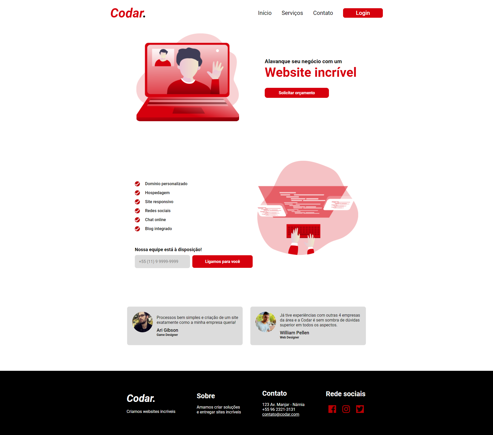

# Desafio: Codar. - DevChallenge
O <a href="https://www.devchallenge.com.br/">DevChallenge</a> é um site onde você pode visualizar layout e propostas de projetos para você aprimorar suas habilidades. Podendo escolher tanto Front-end, Back-end ou ambos, além de filtrar a linguagem que deseja treinar. 

O <a href="https://www.devchallenge.com.br/challenges/5ed47992adee277fae224a0b/details">desafio Codar</a>, é um página de uma empresa que desenvolve Websites.

### Falta:
- [] Deixar a página responsiva

 

<strong>Projeto:</strong> <a href="https://luizfranzon.github.io/Codar-DevChallenge/meu_projeto/index.html">abrir no github pages</a>

